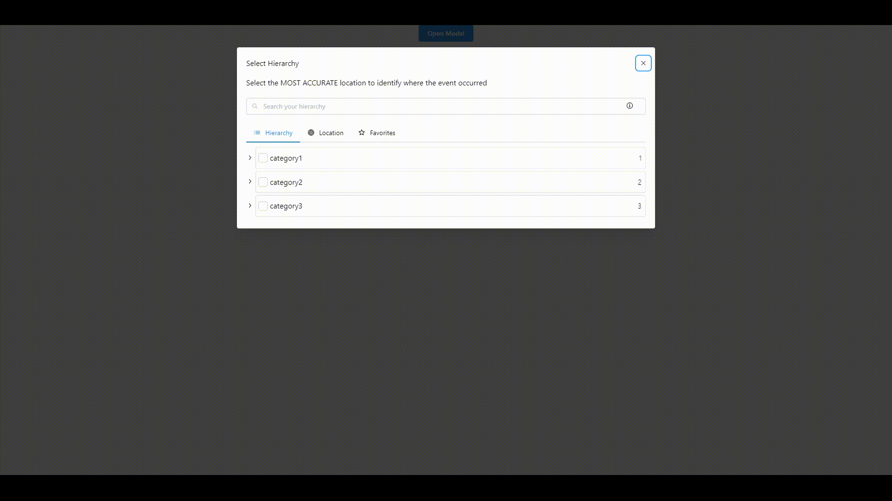

# Hierarchy Filter Search 🔍

This is a React component for filtering server-side application data that follows a hierarchy pattern. Lazy load is also implemented to enhance performance.
**Still in development**

## Installation

`npm i xxxxx`

`yarn add xxxxx`

## 📌 Screenshots



## Usage

React Hierarchy Filter Search is a component that requires data requires data from server when the user needs. 🎉

  * filtered data based on user input
  * Lazy load implemented: do not need to load all data once


```javascript

import HierarchyFilter from 'hierarchy-filter'

function App() {
  return (
    <div className="App">
      <HierarchyFilter />
    </div>
  );
}

export default App;
```


## `props`

| name             | type                 | required?|
| ---------------- |----------------------| ---------|
| `data` | `array` of `object`s               | `false`   |  
| `onChildRequest` | `func`               | `false`   |    
| `eachChildPrep`  | `func`               | `false`  |
| `allowMultipleSelection`  | `func`  | `false`   |
| `initialValue`   | `array` of `object`s | `false`  |
